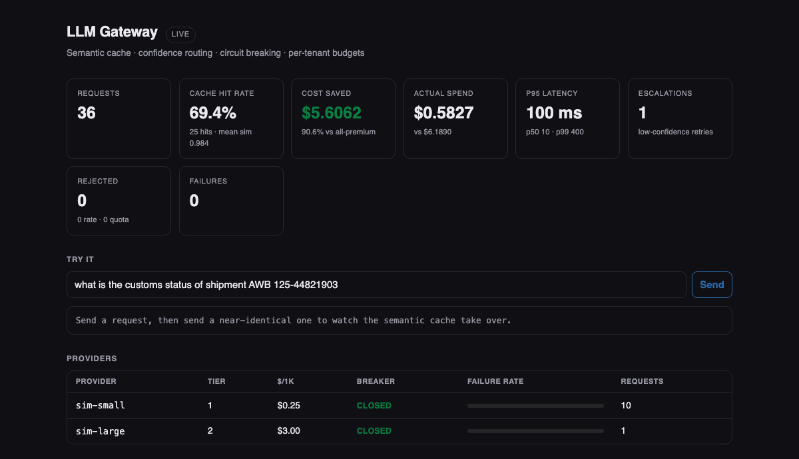

# llm-gateway

A reliability and cost-control layer that sits between your services and your LLM
providers. Semantic caching, confidence-based model routing, per-provider circuit
breaking, and per-tenant budgets — Java 21 and Spring Boot 3.

Runs with no API keys and no network: simulated providers are wired in by default, so
`mvn spring-boot:run` gives you a working gateway and a live dashboard immediately.

```bash
mvn test              # 53 tests
mvn spring-boot:run   # dashboard at http://localhost:8080
./benchmark.sh        # drives representative traffic, prints measured results
```



*The dashboard after one `./benchmark.sh` run. Every number is live from `/v1/stats`;
the provider table shows each circuit breaker's state and rolling failure rate.*

---

## The problem

Calling an LLM provider directly from application code works until it doesn't. Then you
discover, usually in production, that:

- The same question asked five slightly different ways costs five inferences.
- Every request pays frontier-model prices, including the 80% that a small model would
  have answered correctly.
- When a provider degrades, your retries make it worse and your latency goes with it.
- One tenant's runaway loop burns the shared account quota and everyone else gets 429s.

None of these are model problems. They are the same distributed-systems problems as any
other unreliable, metered, shared upstream dependency — and they have the same answers:
cache, route, break, and budget.

---

## Measured result

From `./benchmark.sh`, 36 requests of representative support-desk traffic (a handful of
base questions asked repeatedly with harmless rewording, plus one long open-ended
request):

```
  requests              36
  cache hit rate        58.3%  (21 hits)
  mean hit similarity   0.9904
  escalations           1
  actual spend          $0.6182
  if all-premium        $6.4200
  cost saved            $5.8017  (90.4%)
  p50 / p95 / p99       10 / 100 / 400 ms
  failures              0

  by provider: {"cache": 21, "sim-small": 14, "sim-large": 1}
```

**These are simulated-provider numbers, not a claim about production.** They demonstrate
that the mechanisms work and are instrumented; the absolute figures depend entirely on
your traffic shape. Traffic with no repetition gets no cache benefit, and traffic that is
uniformly hard gets no routing benefit. The point of the dashboard and `/v1/stats` is
that you can measure your own mix rather than guess.

Latency percentiles are histogram bucket ceilings, so p95 = 100 ms means "at or below
100 ms", not exactly 100.

---

## Design decisions worth reading

### Pipeline order is chosen by cost

```
budget check  →  semantic cache  →  routed provider call  →  cache write
```

Budget rejection is free, so it happens first — no sense embedding a prompt for a tenant
that is over quota. The cache runs before any provider call because a hit costs one
embedding instead of one inference. Routing is last because it is the only step that
spends real money.

### The cache threshold is a correctness decision, not a tuning knob

Set similarity too low and the cache serves a confidently wrong answer to a question
nobody asked. That is worse than a miss and far harder to notice, because it never shows
up as an error — just as a slow drift in answer quality. The default is a conservative
0.95, and every hit records the similarity that produced it so bad matches stay
auditable after the fact.

The bundled `HashingEmbedder` is lexical, not semantic: it matches on word and bigram
overlap, so "cancel my order" and "I'd like a refund" will *not* match. That is a
deliberate floor rather than a limitation to hide — it keeps the cache honest offline and
makes its behaviour reproducible in tests. Swap in a real embedding endpoint behind the
`Embedder` interface and the cache logic is unchanged.

### Confidence routing can cost more than no routing

If the cheap tier never clears the escalation threshold, every request pays for a cheap
call *and* an expensive one — strictly worse than sending everything to the large model.
This is not hypothetical: the first run of `benchmark.sh` on this repo did exactly that,
because the simulated small model's confidence (0.62) sat under the default threshold
(0.75) for every prompt. It was invisible in the cost total and obvious in the
per-provider counts, which is why `/v1/stats` breaks out `requestsByProvider`.

Whether cheap-tier answers are actually *good enough to keep* is an evaluation question,
not a gateway question. That is what the companion
[llm-eval](https://github.com/vjsravan/llm-eval) project measures.

### Circuit breaker details that are usually got wrong

**A minimum call count before the breaker may open.** Without it, the first failure of
the day sits at a 100% failure rate and takes a healthy provider out of rotation.

**Half-open admits a bounded number of probes, not everything.** Dumping full production
traffic at a provider that has just recovered is how you cause the second outage, and the
second one is usually longer than the first.

**Permanent failures do not trip the breaker.** A 400 for a malformed prompt is the
caller's fault; letting it open the circuit means one bad client can deny service to
everyone. Only retryable failures count.

### Retry jitter is not decoration

Without jitter, every client that failed during the same upstream blip retries at the
same instant and the recovering provider is hit by a synchronised herd. Backoff uses full
jitter — sleep uniformly in `[0, backoff]` — which spreads that load flat.

### Rate limiting uses a token bucket, not a fixed window

A fixed window lets a caller spend its whole allowance in the last second of one window
and again in the first second of the next: an instantaneous burst of double the intended
rate, arriving exactly when the provider is least able to absorb it.

---

## API

```bash
curl -X POST localhost:8080/v1/chat \
  -H 'Content-Type: application/json' \
  -H 'X-Tenant-Id: acme' \
  -d '{"prompt":"what is the customs status of AWB 125-44821903","maxTokens":256}'
```

```json
{
  "text": "[sim-small] response to: what is the customs status of AWB 125-44821903",
  "servedBy": "sim-small",
  "cacheHit": false,
  "escalated": false,
  "routingReason": "confidence 0.84 met threshold on first tier",
  "totalTokens": 46,
  "costUsd": 0.0115,
  "latencyMs": 50,
  "correlationId": "fb3cefac-550"
}
```

The response is deliberately transparent about how the answer was produced. A caller that
cannot tell a cache hit from a fresh inference cannot reason about its latency or its bill.

| endpoint | purpose |
|---|---|
| `POST /v1/chat` | completion through the full pipeline |
| `GET /v1/stats` | everything the dashboard renders |
| `GET /v1/tenants/{id}/usage` | per-tenant quota consumption |
| `GET /actuator/health` | liveness |

Status codes are chosen so a client can act without parsing the body: **429** with
`Retry-After` for rate limits, **402** for an exhausted token quota (retrying will not
help until the window resets), **503** when every provider is down, **400** for
validation. Returning 500 for all of these — the common shortcut — gives the caller
nothing to decide with.

Every request carries a correlation id through SLF4J's `MDC`, so one completion can be
traced across the cache decision, the routing path, and any retries.

---

## Plugging in a real provider

Implement `LlmProvider` and register it in `GatewayApplication#router`. Nothing else in
the pipeline changes — that separation is why the reliability logic is testable at all.

```java
public class AnthropicProvider implements LlmProvider {
    public String name() { return "claude-sonnet-5"; }
    public int tier() { return 2; }
    public double costPer1kTokens() { return 3.00; }

    public Completion complete(String prompt, int maxTokens) throws ProviderException {
        try {
            var msg = client.messages().create(...);
            return new Completion(text, promptTokens, outputTokens, confidence, name());
        } catch (RateLimitException e) {
            throw new ProviderException(name(), e.getMessage(), true);   // retryable
        } catch (BadRequestException e) {
            throw new ProviderException(name(), e.getMessage(), false);  // permanent
        }
    }
}
```

Getting the `retryable` flag right is the entire contract. Everything above the provider
depends on it.

---

## Tests

53 tests, no mocking framework required — the seams are constructor arguments.

| area | covers |
|---|---|
| `ResilienceTest` | breaker state machine, probe budget, minimum-sample floor, backoff bounds, jitter, permanent-vs-retryable |
| `CacheAndRoutingTest` | cache hit/miss/TTL/LRU, embedder determinism and word order, tier selection, escalation, failover, open-breaker skip |
| `TenantBudgetTest` | burst, gradual refill, tenant isolation, quota exhaustion and window rollover |
| `GatewayApiTest` | full Spring context — status codes, validation, `Retry-After`, cache transparency, stats, health |

Each API test uses a distinct tenant id so the shared rate limiter cannot leak state
between tests. A suite whose result depends on execution order is worse than no suite,
because it teaches people to rerun until green.

---

## Configuration

All knobs are under `gateway.*` in `application.yml`:

| property | default | notes |
|---|---|---|
| `cache-similarity-threshold` | `0.95` | correctness decision — see above |
| `cache-ttl-seconds` | `900` | model outputs go stale |
| `escalation-confidence-threshold` | `0.75` | tune against an eval suite, not by feel |
| `max-retry-attempts` | `3` | |
| `rate-limit-burst` / `rate-limit-per-second` | `20` / `5.0` | token bucket |
| `token-quota-per-window` | `200000` | per tenant |

---

## License

MIT
